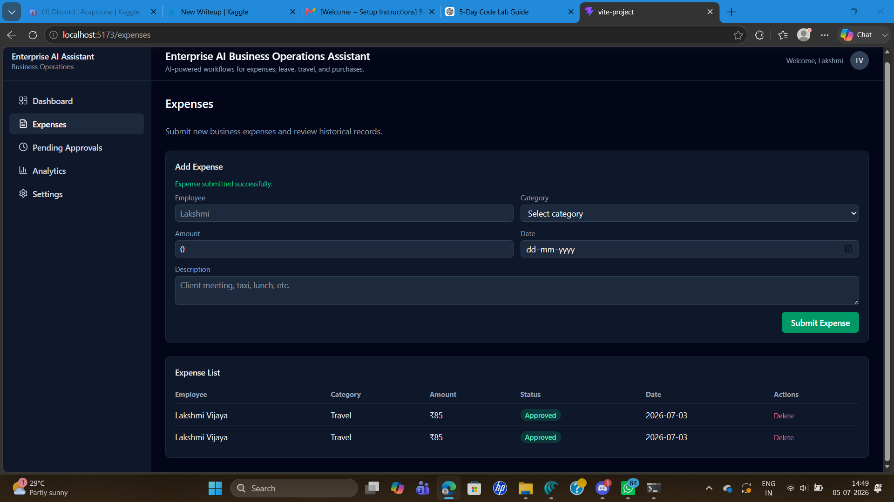
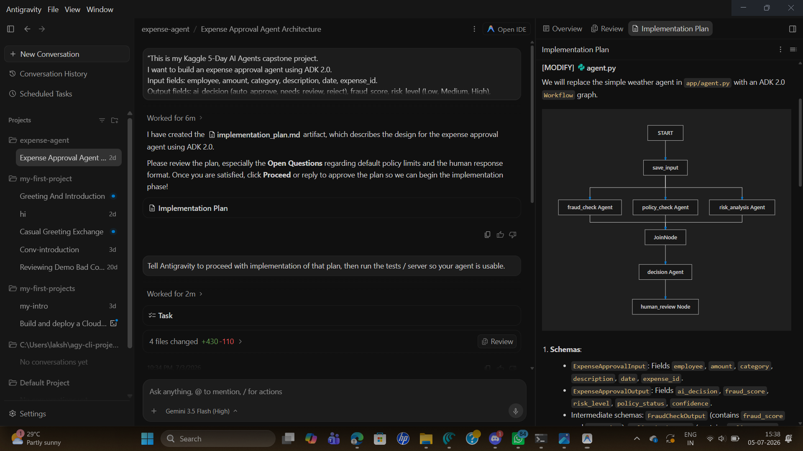
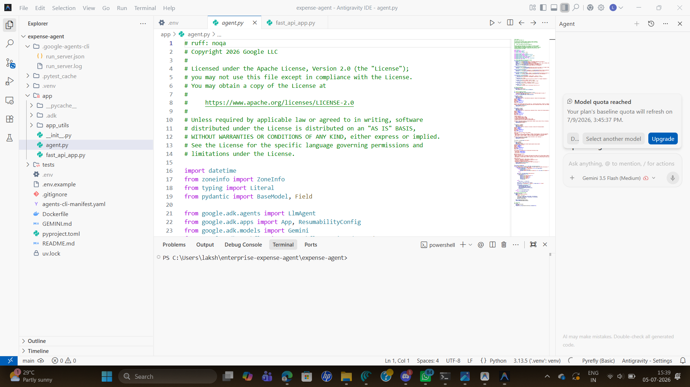
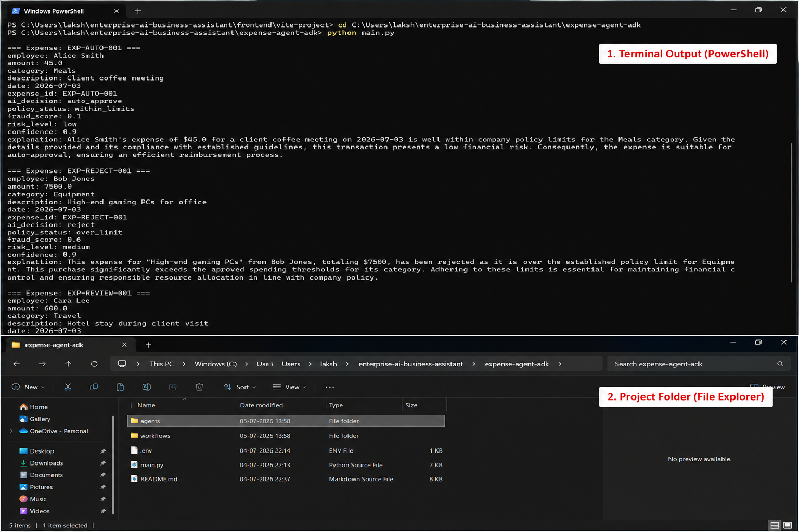
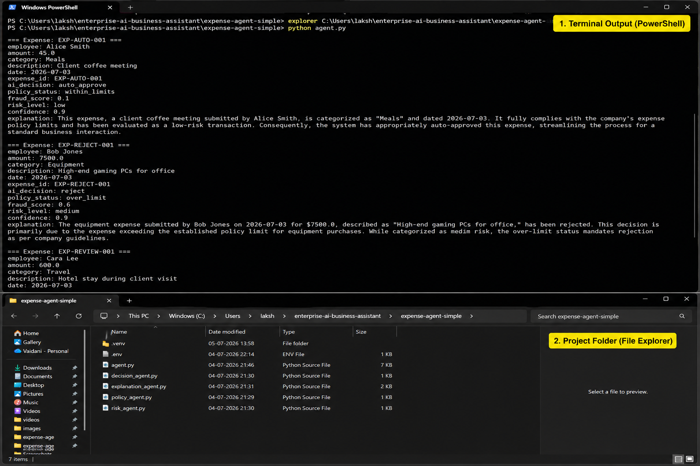

# Enterprise AI Business Operations Assistant
AI-powered expense review assistant with a frontend dashboard, FastAPI backend, and multi-agent workflow that automates expense decisions and generates human-readable explanations

## 1. Problem

Manual expense review is slow, inconsistent, and difficult to audit.

Finance teams must read every expense line item and cross-check policies. Approvals and rejections can be subjective and hard to explain to employees. Managers lack a quick overview of how many expenses are pending, approved, or rejected, and why those decisions were made. This project explores how enterprise AI agents can automate routine expense decisions while keeping the process transparent and explainable.


## 2. Solution Overview

This project implements an **Enterprise AI Business Operations Assistant** that focuses on expense management.

The system ingests structured expense data (employee, amount, category, description, date) and runs it through a multi-agent AI workflow that checks policy compliance, estimates risk, makes an approve/reject/review decision, and generates a natural-language explanation for each expense. Results are exposed through a FastAPI backend and a frontend dashboard that shows expenses, decisions, and summary analytics. The goal is to automate routine, low-risk approvals and flag only ambiguous cases for humans, improving both efficiency and traceability.

---

## 3. Architecture

The system is organized into three main components: frontend dashboard, backend API, and a multi-agent expense review engine.

### 3.1 Frontend (Dashboard)

- Built with a modern JavaScript stack (e.g., React + Vite).
- Provides pages for:
  - Dashboard
  - Expenses
  - Pending Approvals
  - Analytics
  - Settings
- Communicates with the backend via HTTP APIs to fetch expense lists, decisions, and analytics.
- Designed as the primary interface for business users, finance analysts, and managers.




### 3.2 Backend (FastAPI Service)

- REST API implemented using **FastAPI**, running under **Uvicorn**.
- Responsible for exposing:
  - Expense data and AI decisions.
  - Aggregated analytics, such as total expenses, approved, rejected, and pending counts.
- Example analytics endpoint:

`GET /analytics`

Response structure (example):

```json
{
  "total_expenses": 2,
  "pending": 0,
  "approved": 2,
  "rejected": 0,
  "approval_ratio": 100.0,
  "rejected_ratio": 0.0
}
```

- The frontend consumes this endpoint to render analytics cards and charts.

### 3.3 Multi-Agent Expense Review Engine (ADK-based)

- Implemented as a Python workflow that orchestrates multiple agents in sequence:
  - **Policy Agent** – checks whether the expense complies with company policy (limits by amount/category, timing, etc.).
  - **Risk Agent** – estimates fraud likelihood and assigns a risk level (e.g., low, medium, high).
  - **Decision Agent** – combines policy and risk findings to produce a final decision:
    - `auto_approve`
    - `reject`
    - `review` (borderline cases for human review)
  - **Explanation Agent** – generates a natural-language explanation for the decision.
- Uses the **Gemini API** (for example, `gemini-2.5-flash`) to generate clear, user-friendly explanations for each decision.
- Includes basic fallback behavior for explanation generation when API quota is exhausted or unavailable, so the workflow still returns a reasonable explanation string.


### 3.4 Optional Antigravity Agent Building

The main multi-agent implementation uses a custom Python workflow and the Gemini API. As an **optional, experimental** extension, the project also considers using **Antigravity** for agent building and orchestration. Antigravity can be used to define and run agents in an alternative style, allowing comparison of ergonomics and performance with the current ADK-based design. The core project does not depend on Antigravity to run; it is purely optional for further experimentation.

---
## Antigravity UI




## Antigravity Open IDE




## 4. Features

- Frontend dashboard with navigation for:
  - Dashboard overview
  - Expense list
  - Pending approvals / review queue
  - Analytics
  - Settings

- FastAPI backend that:
  - Serves aggregated analytics via `/analytics`.
  - Acts as the data layer for the frontend dashboard.

- Multi-agent expense review workflow that:
  - Evaluates expenses along policy and risk dimensions.
  - Produces structured decisions (`auto_approve`, `reject`, `review`).
  - Generates natural-language explanations for each decision.

- Simple agent prototype that:
  - Implements a smaller, compact agent logic.
  - Demonstrates the evolution from a simple script to a modular multi-agent architecture.

- Optional integration with Antigravity for alternative agent-building workflows.

---

## 5. Tech Stack

**Frontend**

- React + Vite
- JavaScript/TypeScript
- HTTP client (fetch or Axios)

**Backend**

- Python 3.x
- FastAPI
- Uvicorn

**AI & Agents**

- Python-based multi-agent orchestration
- Gemini API for explanation generation
- Optional Antigravity for experimental agent building

**Other**

- Git / GitHub for version control
- Markdown for documentation

---

## 6. Getting Started

This section describes how to set up and run the backend, frontend, and agent workflows on a local machine.

### 6.1 Prerequisites

- Python 3.x installed.
- Node.js and npm installed.
- Git installed.
- A Gemini API key if you want live explanation generation.

### 6.2 Clone the Repository

```bash
git clone https://github.com/<your-username>/<your-repo-name>.git
cd <your-repo-name>
```

Replace `<your-username>` and `<your-repo-name>` with your actual GitHub username and repository name.

---

### 6.3 Backend Setup and Run

1. Navigate to the backend directory:

```bash
cd backend
```

2. Create and activate a virtual environment:

On Windows:

```bash
python -m venv .venv
.venv\Scripts\activate
```

On macOS / Linux:

```bash
python -m venv .venv
source .venv/bin/activate
```

3. Install Python dependencies:

```bash
pip install -r requirements.txt
```

4. Start the FastAPI backend using Uvicorn:

```bash
uvicorn app:app --reload
```

5. The backend should now be running at:

- `http://127.0.0.1:8000/`
- `http://127.0.0.1:8000/analytics` for analytics JSON.

---

### 6.4 Frontend Setup and Run

1. In a separate terminal, navigate to the frontend directory:

```bash
cd frontend/vite-project
```

2. Install frontend dependencies:

```bash
npm install
```

3. Start the development server:

```bash
npm run dev
```

4. Open the frontend in your browser at:

- `http://localhost:5173/`

---

### 6.5 Multi-Agent Workflow (Expense-Agent-ADK)

1. Open another terminal and navigate to the multi-agent folder:

```bash
cd expense-agent-adk
```

2. Install required dependencies:

```bash
pip install -r requirements.txt
```

3. Run the multi-agent expense workflow demo:

```bash
python main.py
```

## Multi-Agent Architecture




4. The script will iterate through sample expenses and print, for each expense:

- Expense details (ID, employee, amount, category, description, date).
- Policy status.
- Risk level and fraud score.
- Final AI decision.
- Generated explanation text.

This terminal output demonstrates how multiple agents collaborate to produce a decision and explanation.

---

### 6.6 Simple Agent Prototype (Optional)

1. Navigate to the simple agent prototype folder:

```bash
cd expense-agent-simple
```

2. Install dependencies (if needed):

```bash
pip install -r requirements.txt
```

3. Run the simple agent script:

```bash
python agent.py
```

(or `python main.py` depending on the file name in this folder).

This prototype shows a more compact agent logic, useful for understanding the core idea before the system was expanded into a fully modular, multi-agent design.

---

## Single Agent Architecture



## 7. Usage Walkthrough

Once backend and frontend are running, and the multi-agent workflow is available, you can navigate through the system as a user.

### 7.1 Frontend Navigation

- Open `http://localhost:5173/` in your browser.
- Use the top navigation bar to move between:
  - **Dashboard** – overall summary of expenses and AI decisions.
  - **Expenses** – detailed list of expenses with policy status, risk, and AI decisions.
  - **Pending Approvals / Review** – expenses that require human review.
  - **Analytics** – charts and statistics derived from the backend `/analytics` endpoint.
  - **Settings** – placeholder area for configuration and preferences.

### 7.2 Backend Analytics

- Visit `http://127.0.0.1:8000/analytics` in your browser or via a tool like curl/Postman.
- Confirm that the backend is returning aggregated metrics such as:
  - `total_expenses`
  - `approved`
  - `rejected`
  - `pending`
  - `approval_ratio`
  - `rejected_ratio`

The frontend’s Analytics page consumes this endpoint to display summary statistics.

### 7.3 Multi-Agent Terminal Output

- With the multi-agent workflow running (`python main.py` in `expense-agent-adk`), observe the printed output.
- For each expense, verify:
  - The policy agent’s assessment of policy compliance.
  - The risk agent’s risk level and fraud score.
  - The decision agent’s choice (`auto_approve`, `reject`, `review`).
  - The explanation agent’s natural-language justification.

This provides an end-to-end view of how the AI assistant reasons about each expense.

---

## 8. Project Structure

The repository is organized into multiple folders to keep frontend, backend, and agent logic modular and clear.

```text
.
├── backend/
│   ├── app.py                # FastAPI application entrypoint
│   └── ...                   # API routes, models and configuration
├── frontend/
│   └── vite-project/         # React/Vite frontend source code
├── expense-agent-adk/
│   ├── agents/               # Policy, Risk, Decision, Explanation agents
│   ├── workflows/            # expense_workflow.py orchestrating the agents
│   └── main.py               # Multi-agent workflow demo script
├── expense-agent-simple/
│   ├── agent.py              # Simple prototype agent implementation
│   └── ...                   # Supporting files for the simple prototype
├── docs/
│   ├── architecture.png      # Architecture diagram (optional)
│   ├── dashboard.png         # Dashboard screenshot (optional)
│   └── analytics.png         # Analytics screenshot (optional)
└── README.md
```


## 10. Limitations and Future Work

This project is a demonstration and has several intentional limitations.

### 10.1 Current Limitations

- Uses sample expense data rather than a production financial system.
- Policy and risk rules are simplified for clarity and demonstration.
- Gemini API usage may be constrained by free-tier quotas; when quota is exhausted, fallback explanations are used.
- Authentication, authorization, and role-based access control are minimal or not implemented in this demo.
- Persistence relies on local or in-memory models rather than a hardened production database.

### 10.2 Future Enhancements

- Integrate with real HR/finance/ERP systems to ingest live expense data.
- Expand policy rules to cover more complex corporate policies and exceptions.
- Implement full authentication and role-based permissions for different user types.
- Add comprehensive logging and monitoring for auditability.
- Deepen integration with **Antigravity** to standardize agent definition and orchestration, and benchmark its developer experience and performance against the current multi-agent implementation.
- Extend the dashboard with more filters, drilldowns, and export capabilities.

---

## 11. Acknowledgements

- Built as part of a **Kaggle x Google Gemini** capstone / competition context.
- Uses the **Gemini API** to generate natural-language explanations for expense decisions.
- Inspired by the idea of **Enterprise AI Assistants** that automate operational workflows while keeping humans in the loop and maintaining transparency.

